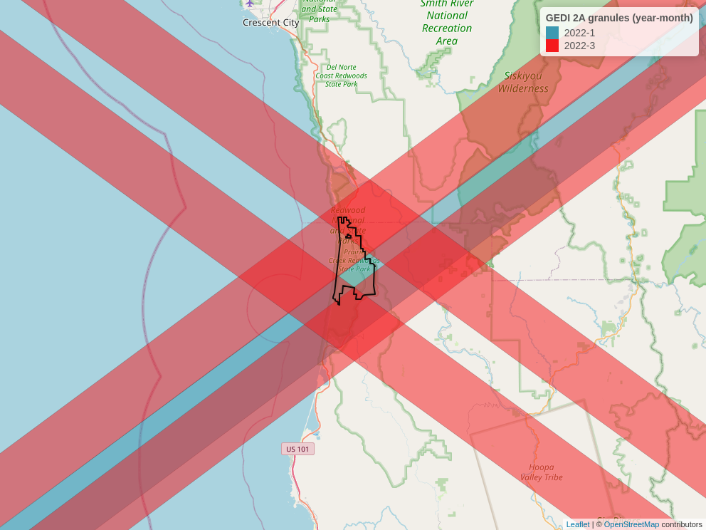

<!-- README.md is generated from README.Rmd. Please edit that file -->

```{r, include = FALSE}
knitr::opts_chunk$set(
  collapse = TRUE,
  comment = "#>",
  fig.path = "man/figures/README-",
  out.width = "100%"
)
```

# chewie

<!-- badges: start -->
[](https://lifecycle.r-lib.org/articles/stages.html#experimental)
<!-- badges: end -->

<p align="center">

</p>

  *Still in a developmental phase - only level-2A data available at present.*

The goal of chewie is to make downloading GEDI data as fast and as simple as 
possible. Here is a quick summary of features that enables {chewie} to achieve 
this:

-  Support for spatial filtering of swaths that intersect an area of interest 
and not only by bounding box; this can frequently reduce the amount of 
irrelevant data that is downloaded.

- GEDI is provided in large files in the h5 format. Whilst performative, the 
disk space required to store these files is large ~ 2-3GB per GEDI 2A file. 
This package downloads the data (as we know of no way to stream these files) and 
then converts them to parquet format which have a file size of  100-200MB per
file. Further, the parquet format enables dynamic filtering of the data without
having to load the entire file into memory - this includes spatial filtering 
(at least crudely for now based on bounding box until geoparquet is more widely
supported).

- In terms of "ease of use" the package is designed to be as simple as possible.
with the main feature here being the automated caching of files in a central 
location. This means that once a file has been downloaded it will not be
downloaded again even if working in a different project (it is also possible to
specify a different cache location for each project). 

- The scope of this package is intended to be deilibertly narrow. It is not 
intended to include functionality for post processing or modelling.


TO DO:

- [ ] Add conversion methods for 1B, 2B and 4A data

- [ ] Add a `chewie_show` method to plot footprints

- [ ] Add a functionality to get level 4a data
  
- [ ] Add cache reporting to `chewie_health_check` - i.e. n files in cache, 
size of cache, etc.

- [ ] refactor to use {collapse} instead of {data.table} or maybe just use dplyr
as this really has to be a "depends" anyway and we're not really making the most
of the data.table functionality as it stands because we are using arrow for the
data qurying etc. 

- [ ] Currently a sort of bug exists whereby if you drop the lat long columns
after running  `geb_gedi`, then the `collect_gedi` function will fail. Needs a
little thought or maybe just a better error message...

- [ ] write tests...


## Installation

You can install the development version of chewie like so:

```{r, eval = FALSE}
# install.packages("pak")
pak::pkg_install("Permian-Global-Research/chewie")
```

## Example

First, let's load in some libraries. {dplyr} isn't essential but it is 
recommended as it's an excellent and highly performative option for working with 
arrow datasets.

```{r load-libs}
library(chewie)
library(dplyr, warn.conflicts = FALSE)
library(sf)
```

Here are some useful helper functions to set up your credentials (using 
`chewie_creds()`) and check that those credentials and the cache are set up 
correctly (using `chewie_health_check()`). By default the cache is set up in the 
`.chewie` folder in your home directory. You can change this by running 
`chewie_cache_set()`.

```{r, eval = FALSE}
chewie_creds() # to set up your credentials
chewie_health_check() # to check your credentials and cache setup.
```

In this chunk we search for some GEDI 2A data that intersects with the Haywood
county in North Carolina. We then plot the footprints of the swaths that
intersect with this area to check out what we've got. Note that by default,
both `find_gedi` and `grab_gedi` cache their outputs so when these functions are
re-run, the data will be loaded from the cache rather than downloaded again, 
even in a different R session.

we can print and plot the results of `find_gedi` to check that we have the data
we want.

```{r find-data}
nc <- system.file("gpkg", "nc.gpkg", package = "sf")
hw <- subset(read_sf(nc), NAME == "Haywood")

gedi_2a_search <- find_gedi(hw,
  gedi_product = "2A",
  date_start = "2022-12-31"
)

print(gedi_2a_search)

plot(gedi_2a_search)
```

Or alternatively plot a leaflet map with `chewie_show`, which can be static or 
interactive.
```{r, show-find-data, include=FALSE}
swath_map <- chewie_show(
  gedi_2a_search,
  time_group = "month",
  zoom = 10,
  interactive = FALSE,
  file = "man/figures/README-show-find-data-1.png"
)
```
```{r, show-find-data-example, eval=FALSE}
chewie_show(
  gedi_2a_search,
  time_group = "month",
  zoom = 8
)
```
```{r, show-fig, echo=FALSE}

```

Now we use `grab_gedi` to download the data - this function internally, converts
the data to parquet format and stores it in the cache. The data is as an arrow
dataset. We can then use any dplyr verbs to filter/select the data as we wish 
before finally using `collect_gedi` to convert the data to a sf object. 
```{r collect-data}
gedi_2a_sf <- grab_gedi(gedi_2a_search) |>
  filter(
    quality_flag == 1,
    degrade_flag == 0
  ) |>
  select(
    beam, date_time, solar_elevation, lat_lowestmode, lon_lowestmode,
    elev_highestreturn, elev_lowestmode, rh0, rh25, rh50, rh75, rh100
  ) |>
  collect_gedi(gedi_find = gedi_2a_search)

print(gedi_2a_sf)

plot(gedi_2a_sf["rh75"], axes = TRUE, reset = FALSE)
plot(sf::st_transform(hw[0], sf::st_crs(gedi_2a_sf)), add = TRUE, reset = FALSE)
```


## Other relevant packages
- [{rGEDI}](https://github.com/carlos-alberto-silva/rGEDI) provides the ability
download GEDI data but also a great deal of additional functionality for 
visualisation, post processing and modelling.

- [{GEDI4R}](https://github.com/VangiElia/GEDI4R) which similiarly provides a 
suit of tools for downloading, visualising and modelling GEDI data, but with a
focus on the 4A product.

Both of these packages have been a great source of inspiration for this package
we would like to thank the authors for their great work! 