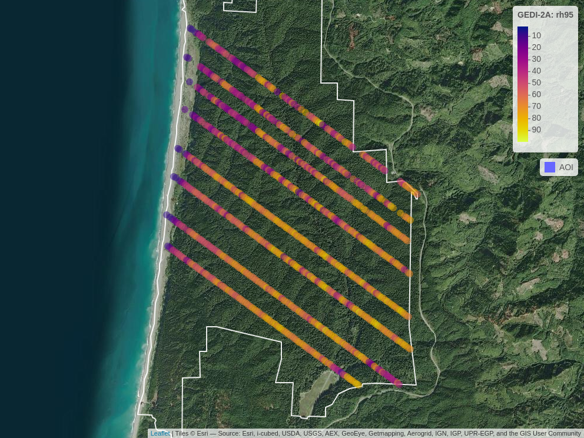

<!-- README.md is generated from README.Rmd. Please edit that file -->

```{r, include = FALSE}
knitr::opts_chunk$set(
  collapse = TRUE,
  comment = "#>",
  fig.path = "man/figures/README-",
  out.width = "100%"
)
```

# chewie

<!-- badges: start -->
[](https://lifecycle.r-lib.org/articles/stages.html#experimental)
<!-- badges: end -->

The goal of chewie is to make downloading GEDI data as fast and as simple as 
possible. This includes point-level products: 1B, 2A, 2B and 4A.
Here is a quick summary of design choices that enables {chewie} to 
achieve this:

- chewie adopts an R-centric approach to downloading GEDI data. Data are 
  downloaded and converted to parquet files which can then be read using 
  [{arrow}](https://arrow.apache.org/docs/r/index.html) and converted to 
  [sf](https://r-spatial.github.io/sf/) objects. This approach is performative 
  and enables the use of [dplyr](https://dplyr.tidyverse.org/) verbs to `filter`, 
  `mutate` and `select` data as required without needing to load all shots, from
  a given swath/granule, into memory.

-  There is support for spatial filtering of swaths that intersect an area of 
  interest and not only by bounding box; this frequently reduces the amount 
  of irrelevant data that is downloaded.

- A system-level cache is used to store the data. This means that once a file
  has been downloaded it will not be downloaded again even if working in a 
  different project (it is also possible to specify a different cache location 
  for each project).

- The scope of this package is deliberately narrow. It is not intended to include 
  functionality for complex post processing or modelling.


## Installation

You can install the development version of chewie like so:

```{r, eval = FALSE}
# install.packages("pak")
pak::pkg_install("Permian-Global-Research/chewie")
```

## Example

First, let's load in some libraries. {dplyr} isn't essential but it is 
recommended as it's an excellent and highly performative option for working with 
arrow datasets.

```{r load-libs}
library(chewie)
library(dplyr, warn.conflicts = FALSE)
library(sf)
```

Here are some useful helper functions to set up your credentials (using 
`chewie_creds()`) and check that those credentials and the cache are set up 
correctly (using `chewie_health_check()`). By default the cache is set up in the 
`.chewie` folder in your home directory. You can change this by running 
`chewie_cache_set()`.

```{r, eval = FALSE}
chewie_creds() # to set up your credentials
chewie_health_check() # to check your credentials and cache setup.
```

In this chunk we search for some GEDI 2A data that intersects with the Haywood
county in North Carolina. We then plot the footprints of the swaths that
intersect with this area to check out what we've got. Note that by default,
both `find_gedi` and `grab_gedi` cache their outputs so when these functions are
re-run, the data will be loaded from the cache rather than downloaded again, 
even in a different R session.

we can print and plot the results of `find_gedi` to check that we have the data
we want.

```{r find-data}
nc <- system.file("gpkg", "nc.gpkg", package = "sf")
hw <- subset(read_sf(nc), NAME == "Haywood")

gedi_2a_search <- find_gedi(hw,
  gedi_product = "2A",
  date_start = "2022-12-31"
)

print(gedi_2a_search)
```

Whilst there is a `plot` method for *chewie.find* objects, a great alternative 
is to plot a leaflet map with `chewie_show`, which can be static or 
interactive (this uses the fantastic {mapview} under the hood).
```{r, show-find-data, include=FALSE}
swath_map <- chewie_show(
  gedi_2a_search,
  time_group = "month",
  zoom = 10,
  interactive = FALSE,
  file = "man/figures/README-show-find-data-1.png"
)
```
```{r, show-find-data-example, eval=FALSE}
chewie_show(
  gedi_2a_search,
  time_group = "month",
  zoom = 8
)
```
```{r, show-fig, echo=FALSE}
knitr::include_graphics("man/figures/README-show-find-data-1.png")
```

Now we use `grab_gedi` to download the data - this function internally, converts
the data to parquet format and stores it in the cache. The data is as an arrow
dataset. We can then use any {dplyr} verbs to filter/select the data as we wish 
before finally using `collect_gedi` to convert the data to a sf object. If no
filtering/selection is carried out then `collect_gedi` will return all the 
available columns.

```{r collect-data}
gedi_2a_sf <- grab_gedi(gedi_2a_search) |>
  filter(
    quality_flag == 1,
    degrade_flag == 0
  ) |>
  select(
    beam, date_time, solar_elevation, lat_lowestmode, lon_lowestmode,
    elev_highestreturn, elev_lowestmode, rh0, rh25, rh50, rh75, rh100
  ) |>
  collect_gedi(gedi_find = gedi_2a_search)

print(gedi_2a_sf)
```

Finally, we can plot the data. Again we can use the generic `chewie_show` 
function.

```{r, show-2a-data, include=FALSE}
swath_map <- chewie_show(
  gedi_2a_sf,
  zcol = "rh100",
  zoom = 12,
  interactive = FALSE,
  file = "man/figures/README-show-2a-data-1.png"
)
```
```{r, show-2a-data-example, eval=FALSE}
chewie_show(
  gedi_2a_sf,
  zcol = "rh90",
  zoom = 12
)
```
```{r, show-fig-2a, echo=FALSE}

```


## Other relevant packages
- [{rGEDI}](https://github.com/carlos-alberto-silva/rGEDI) provides the ability
download GEDI data but also a great deal of additional functionality for 
visualisation, post-processing and modelling.

- [{GEDI4R}](https://github.com/VangiElia/GEDI4R) which similarly provides a 
suit of tools for downloading, visualising and modelling GEDI data, but with a
focus on the 4A product.

Both of these packages have been a great source of inspiration;
we would like to thank the authors for their great work! 