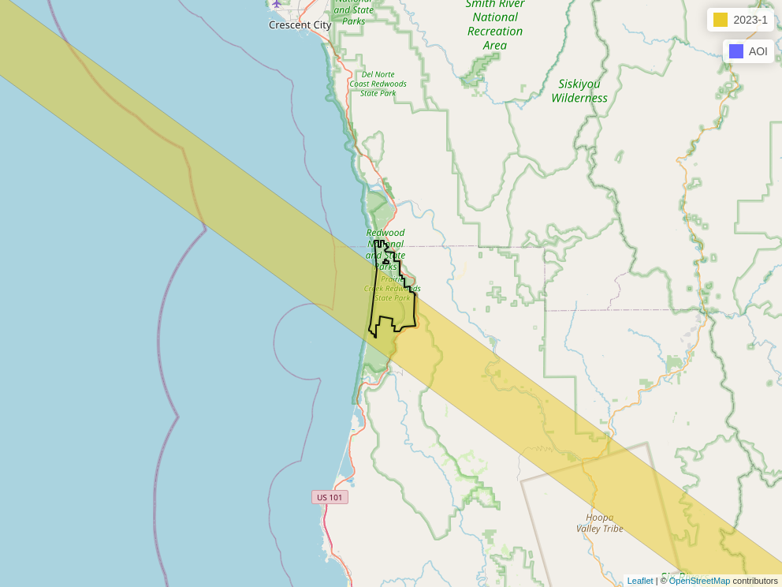

<!-- README.md is generated from README.Rmd. Please edit that file -->

```{r, include = FALSE}
knitr::opts_chunk$set(
  collapse = TRUE,
  comment = "#>",
  fig.path = "man/figures/README-",
  out.width = "100%"
)
```

# chewie 


<!-- badges: start -->
[](https://lifecycle.r-lib.org/articles/stages.html#experimental)
[](https://github.com/Permian-Global-Research/chewie/actions/workflows/R-CMD-check.yaml)
[](https://app.codecov.io/gh/Permian-Global-Research/chewie?branch=main)
<!-- badges: end -->

The goal of chewie is to make downloading GEDI data as simple as 
possible. This includes the point-level products: 1B, 2A, 2B and 4A.
Here is a quick summary of design choices that enables {chewie} to 
achieve this:

- Data are downloaded and converted to parquet files which can then be read using 
  [{arrow}](https://arrow.apache.org/docs/r/index.html) and converted to 
  [sf](https://r-spatial.github.io/sf/) objects. This approach is performative 
  as it only requires each entire granule to be loaded into memory once (when 
  it is converted from hdf5 to parquet). From here on we can use
  [dplyr](https://dplyr.tidyverse.org/) verbs (or base R) to `filter`, 
  `mutate` and `select` data as required without needing to load all shots, from
  a given granule, into memory. 

- A system-level cache is used to store the data. This means that once a file
  has been downloaded it will not be downloaded again even if working in a 
  different project (it is also possible to specify a unique cache location 
  for each project).

- There is support for spatial filtering of granules that intersect an area of 
  interest and not only by a bounding box; this frequently reduces the amount 
  of irrelevant data that is downloaded.

## Installation

You can install the development version of chewie like so:

```{r, eval = FALSE}
# install.packages("pak")
pak::pkg_install("Permian-Global-Research/chewie")
```

## Example

```{r, include=FALSE}
library(chewie)
options("chewie.testing" = TRUE)
temp_dir <- tempdir()

if (!file.exists(".Renviron")) {
  file.create(".Renviron")
}

cache_zip <- system.file(
  "chewie-test-cache.zip",
  package = "chewie"
)

utils::unzip(
  cache_zip,
  exdir = temp_dir
)
temp_cache <- file.path(temp_dir, "chewie-test-cache")

chewie::chewie_setup_cache(temp_cache, renviron = "project")
```

First, let's load in some libraries. {dplyr} isn't essential but it is 
recommended as it's an excellent and highly performative option for working with 
arrow datasets.

```{r load-libs}
suppressPackageStartupMessages({
  library(chewie)
  library(dplyr)
  library(sf)
})
```

Here are some useful helper functions to set up your credentials (using 
`chewie_creds()`) and check that those credentials and the cache are set up 
correctly (using `chewie_health_check()`). By default the cache is set up in the 
`.chewie` folder in your home directory. You can change this by running 
`chewie_cache_set()`.

```{r, eval = FALSE}
chewie_creds() # to set up your credentials
chewie_health_check() # to check your credentials and cache setup.
```

Now, let's search for GEDI 2A data that intersects with the Prairie
Creek Redwoods State Park, California (the dataset is included with the package). 
We then plot the footprints of the granules that intersect with this area to 
check out what we've got. Note that by default, both `find_gedi` and `grab_gedi` 
cache their outputs so, when these functions are re-run, the data will be loaded 
from the cache rather than downloaded again, even in a different R session.

```{r find-data}
prairie_creek <- sf::read_sf(system.file(
  "geojson", "prairie-creek.geojson",
  package = "chewie"
))

gedi_2a_search <- find_gedi(prairie_creek,
  gedi_product = "2A",
  date_start = "2023-01-01",
  date_end = "2023-01-31"
)

print(gedi_2a_search)
```

Whilst there is a `plot` method for *chewie.find* objects, a great alternative 
is to plot a leaflet map with `chewie_show`, which can be static or 
interactive (this uses the fantastic {[mapview](https://r-spatial.github.io/mapview/)} 
under the hood).
```{r, show-find-data, include=FALSE}
mapview::mapviewOptions(basemaps = c("OpenStreetMap"))
granule_map <- chewie_show(
  gedi_2a_search,
  zoom = 10,
  interactive = FALSE,
  file = "man/figures/README-show-find-data-1.png"
)
```
```{r, show-find-data-example, eval=FALSE}
chewie_show(
  gedi_2a_search,
  zoom = 8
)
```
```{r, show-fig, echo=FALSE}

```

Now we use `grab_gedi` to download the data - this function internally, converts
the data to parquet format and stores it in the cache. The returned value is 
an *arrow_dplyr_query* object. We can then use {dplyr} verbs to 
`filter`/`select` the data as we wish before finally using `collect_gedi` to 
convert the data to a sf object. If no filtering/selection is carried out then 
`collect_gedi` will return all the available columns/rows for the AOI.

```{r collect-data}
gedi_2a_sf <- grab_gedi(gedi_2a_search) |>
  filter(
    quality_flag == 1,
    degrade_flag == 0
  ) |>
  select(
    beam, date_time, lat_lowestmode, lon_lowestmode, elev_highestreturn,
    elev_lowestmode, rh0, rh25, rh50, rh75, rh95, rh100
  ) |>
  collect_gedi(gedi_find = gedi_2a_search)

print(gedi_2a_sf)
```

Finally, we can plot the data. Again we can use the generic `chewie_show` 
function.

```{r, show-2a-data, include=FALSE}
mapview::mapviewOptions(basemaps = c("Esri.WorldImagery"))
swath_map <- chewie_show(
  gedi_2a_sf,
  zcol = "rh95",
  zoom = 13, alpha = 0.5, aoi_color = "white",
  interactive = FALSE,
  file = "man/figures/README-show-2a-data-1.png"
)
```
```{r, show-2a-data-example, eval=FALSE}
chewie_show(
  gedi_2a_sf,
  zcol = "rh95",
  zoom = 13,
  alpha = 0.5,
  aoi_color = "white"
)
```
```{r, show-fig-2a, echo=FALSE}
knitr::include_graphics("man/figures/README-show-2a-data-1.png")
```


## Other relevant packages/software
- [{rGEDI}](https://github.com/carlos-alberto-silva/rGEDI) provides the ability
download GEDI data but also a great deal of additional functionality for 
visualisation, post-processing and modelling.

- [{GEDI4R}](https://github.com/VangiElia/GEDI4R) which similarly provides a 
suit of tools for downloading, visualising and modelling GEDI data, but with a
focus on the 4A product.

- [pyGEDI](https://github.com/EduinHSERNA/pyGEDI) is a Python package for 
downloading and visualising GEDI data.

- [GEDI-Data-Resources](https://github.com/nasa/GEDI-Data-Resources) is a 
collection of scripts for both python and R that provide examples of how to
download and process GEDI data.

These resources have been a great source of inspiration for {chewie}; we
would like to thank the authors for their great work! 
