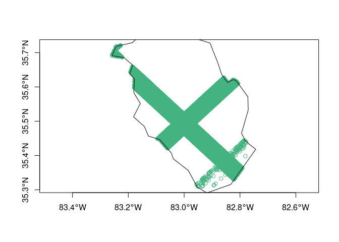

<!-- README.md is generated from README.Rmd. Please edit that file -->

# chewie

<!-- badges: start -->

[](https://lifecycle.r-lib.org/articles/stages.html#experimental)
<!-- badges: end -->

*Still in a developmental phase - only level-2A data available at
present.*

The goal of chewie is to make downloading GEDI data as fast and as
simple as possible. Here is a quick summary of features that enables
{chewie} to achieve this:

  - Support for spatial filtering of swaths that intersect an area of
    interest and not only by bounding box; this can frequently reduce
    the amount of irrelevant data that is downloaded.

  - GEDI is provided in large files in the h5 format. Whilst
    performative, the disk space required to store these files is large
    \~ 2-3GB per GEDI 2A file. This package downloads the data (as we
    know of no way to stream these files) and then converts them to
    parquet format which have a file size of 100-200MB per file.
    Further, the parquet format enables dynamic filtering of the data
    without having to load the entire file into memory - this includes
    spatial filtering (at least crudely for now based on bounding box
    until geoparquet is more widely supported).

  - In terms of “ease of use” the package is designed to be as simple as
    possible. with the main feature here being the automated caching of
    files in a central location. This means that once a file has been
    downloaded it will not be downloaded again even if working in a
    different project (it is also possible to specify a different cache
    location for each project).

  - The scope of this package is intended to be deilibertly narrow. It
    is not intended to include functionality for post processing or
    modelling.

TO DO:

  - [ ] Add conversion methods for 1B, 2B and 4A data

  - [ ] Add a `chewie_show` method to plot footprints

  - [ ] Add a functionality to get level 4a data

  - [ ] Add cache reporting to `chewie_health_check` - i.e. n files in
    cache, size of cache, etc.

  - [ ] refactor to use {collapse} instead of {data.table} or maybe just
    use dplyr as this really has to be a “depends” anyway and we’re not
    really making the most of the data.table functionality as it stands
    because we are using arrow for the data qurying etc.

  - [ ] Currently a sort of bug exists whereby if you drop the lat long
    columns after running `geb_gedi`, then the `collect_gedi` function
    will fail. Needs a little thought or maybe just a better error
    message…

  - [ ] write tests…

## Installation

You can install the development version of chewie like so:

``` r
# install.packages("pak")
pak::pkg_install("Permian-Global-Research/chewie")
```

## Example

``` r
library(chewie)
#> ✔ NASA Earthdata Credentials already set.
#> ✔ GEDI cache set in the following directory:
#> → "/home/hugh/.chewie"

# chewie_creds() # to set up your credentials
# chewie_health_check() # to check your credentials and cache setup.
nc <- system.file("gpkg", "nc.gpkg", package = "sf")
hw <- subset(sf::read_sf(nc), NAME == "Haywood")

gedi_2a_search <- find_gedi(hw,
  gedi_product = "2A",
  date_start = "2022-12-31"
)
#> ! No end date was provided - A Non-permenant cache is in effect.
#> ℹ The cache will be invalidated on 2023-11-01T00:00:00.
#>   To establish a permanent cache set the end date using the `date_end`
#>   argument.
#> ✔ Using cached GEDI data

print(gedi_2a_search)
#> 
#> ── chewie.find ───────────────────────────────────────────────────────────────────────────────────────────────────────────────────
#> •  GEDI-2A
#>                        id          time_start            time_end                                                   url cached
#>                    <char>              <POSc>              <POSc>                                                <char> <lgcl>
#> 1: G2752113657-LPDAAC_ECS 2023-01-09 02:25:28 2023-01-09 03:58:19 https://e4ftl01.cr.usgs.gov//GEDI_L1_L2/GEDI/GEDI0...   TRUE
#> 2: G2752559659-LPDAAC_ECS 2023-01-11 08:34:47 2023-01-11 10:07:37 https://e4ftl01.cr.usgs.gov//GEDI_L1_L2/GEDI/GEDI0...   TRUE
#> 3: G2752391704-LPDAAC_ECS 2023-01-31 17:30:11 2023-01-31 19:03:00 https://e4ftl01.cr.usgs.gov//GEDI_L1_L2/GEDI/GEDI0...   TRUE
#> 4: G2752261157-LPDAAC_ECS 2023-02-02 23:38:56 2023-02-03 01:11:45 https://e4ftl01.cr.usgs.gov//GEDI_L1_L2/GEDI/GEDI0...   TRUE
#> 5: G2753021606-LPDAAC_ECS 2023-02-04 15:53:09 2023-02-04 17:26:01 https://e4ftl01.cr.usgs.gov//GEDI_L1_L2/GEDI/GEDI0...   TRUE
#> 1 variable not shown: [geometry <sfc_POLYGON>]
#> 
#> ──────────────────────────────────────────────────────────────────────────────────────────────────────────────────────────────────

swaths_img <- chewie_show(gedi_2a_search,
  time_group = "month",
  interactive = FALSE
)
#> The legacy packages maptools, rgdal, and rgeos, underpinning this package
#> will retire shortly. Please refer to R-spatial evolution reports on
#> https://r-spatial.org/r/2023/05/15/evolution4.html for details.
#> This package is now running under evolution status 0
```


``` r
gedi_2a_sf <- grab_gedi(gedi_2a_search) |>
  dplyr::filter(
    quality_flag == 0,
    degrade_flag == 0
  ) |>
  collect_gedi(find = gedi_2a_search)
#> ✔ All data found in cache

print(gedi_2a_sf)
#> Simple feature collection with 11032 features and 114 fields
#> Geometry type: POINT
#> Dimension:     XY
#> Bounding box:  xmin: -83.25809 ymin: 35.30825 xmax: -82.77747 ymax: 35.72121
#> Geodetic CRS:  WGS 84
#> # A tibble: 11,032 × 115
#>    beam     shot_number degrade_flag quality_flag delta_time date_time          
#>  * <chr>        <int64>        <int>        <int>      <dbl> <dttm>             
#>  1 BEAM0010       2.e17            0            0 158468440. 2023-01-09 03:00:39
#>  2 BEAM0010       2.e17            0            0 158468440. 2023-01-09 03:00:39
#>  3 BEAM0010       2.e17            0            0 158468440. 2023-01-09 03:00:39
#>  4 BEAM0010       2.e17            0            0 158468440. 2023-01-09 03:00:39
#>  5 BEAM0010       2.e17            0            0 158468440. 2023-01-09 03:00:39
#>  6 BEAM0010       2.e17            0            0 158468440. 2023-01-09 03:00:39
#>  7 BEAM0010       2.e17            0            0 158468440. 2023-01-09 03:00:39
#>  8 BEAM0010       2.e17            0            0 158468440. 2023-01-09 03:00:39
#>  9 BEAM0010       2.e17            0            0 158468440. 2023-01-09 03:00:39
#> 10 BEAM0010       2.e17            0            0 158468440. 2023-01-09 03:00:39
#> # ℹ 11,022 more rows
#> # ℹ 109 more variables: sensitivity <dbl>, solar_elevation <dbl>,
#> #   lat_lowestmode <dbl>, lon_lowestmode <dbl>, elev_highestreturn <dbl>,
#> #   elev_lowestmode <dbl>, rh0 <dbl>, rh1 <dbl>, rh2 <dbl>, rh3 <dbl>,
#> #   rh4 <dbl>, rh5 <dbl>, rh6 <dbl>, rh7 <dbl>, rh8 <dbl>, rh9 <dbl>,
#> #   rh10 <dbl>, rh11 <dbl>, rh12 <dbl>, rh13 <dbl>, rh14 <dbl>, rh15 <dbl>,
#> #   rh16 <dbl>, rh17 <dbl>, rh18 <dbl>, rh19 <dbl>, rh20 <dbl>, rh21 <dbl>, …

plot(gedi_2a_sf[0], axes = TRUE, col = "#43b37f")
plot(sf::st_transform(hw[0], sf::st_crs(gedi_2a_sf)), add = TRUE)
```



## Other relevant packages

  - [{rGEDI}](https://github.com/carlos-alberto-silva/rGEDI) provides
    the ability download GEDI data but also a great deal of additional
    functionality for visualisation, post processing and modelling.

  - [{GEDI4R}](https://github.com/VangiElia/GEDI4R) which similiarly
    provides a suit of tools for downloading, visualising and modelling
    GEDI data, but with a focus on the 4A product.

Both of these packages have been a great source of inspiration for this
package we would like to thank the authors for their great work\!
