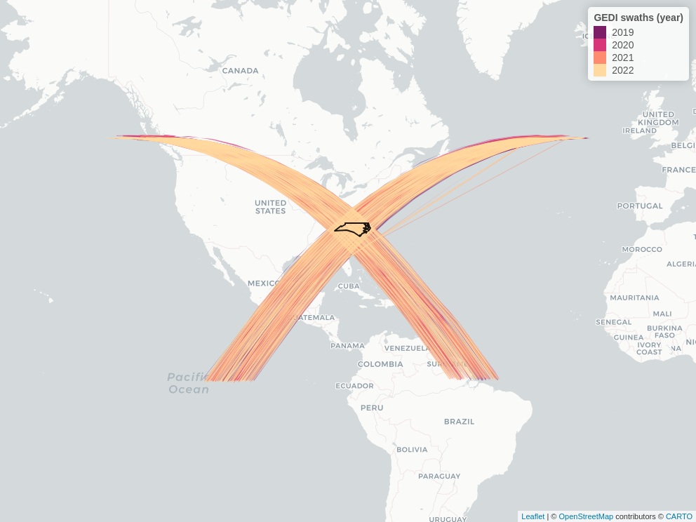

<!-- README.md is generated from README.Rmd. Please edit that file -->

# chewie

<!-- badges: start -->

[](https://lifecycle.r-lib.org/articles/stages.html#experimental)
<!-- badges: end -->

The goal of chewie is to make downloading GEDI data much faster and
simpler. Right now, in order to download a small area of GEDI, you are
required to download very large files with irrelevant data. This package
aims to overcome this issue by using the hdf5 driver from gdal to
download only the data you need.

The data should be saved as a geoarrow format and we should provide
functions to enable efficient cleaning and filtering.

This package should not be a full suit of tools for working with GEDI
data, but a simple, light and information-rich way to access the data.

At present the rGEDI package is the best option for downloading raw GEDI
data but its functionality is very large and goes beyond just
downloading data. As a result installation is not always
straightforward.

TO DO:

  - [ ] Add a function to download the data

  - [ ] Add a function to clean the data

  - [ ] Add a function to filter the data

  - [ ] Add a function to plot the data

  - [ ] Add a functionality to get level 4a data

## Installation

You can install the development version of chewie like so:

``` r
# install.packages("pak")
pak::pkg_install("Permian-Global-Research/chewie")
```

``` r
library(chewie)

# chewie_creds() # to set up your credentials

nc <- system.file("gpkg", "nc.gpkg", package = "sf")
nc_sf <- sf::read_sf(nc)

gedi_nc_2a <- chewie_find(nc_sf,
  gedi_product = "2A", gedi_version = "v2",
  date_start = "2020-01-01"
)


swaths_img <- chewie_show(gedi_nc_2a, interactive=FALSE)
#> The legacy packages maptools, rgdal, and rgeos, underpinning this package
#> will retire shortly. Please refer to R-spatial evolution reports on
#> https://r-spatial.org/r/2023/05/15/evolution4.html for details.
#> This package is now running under evolution status 0
#> Registered S3 method overwritten by 'jsonlite':
#>   method     from   
#>   print.json jsonify
```


