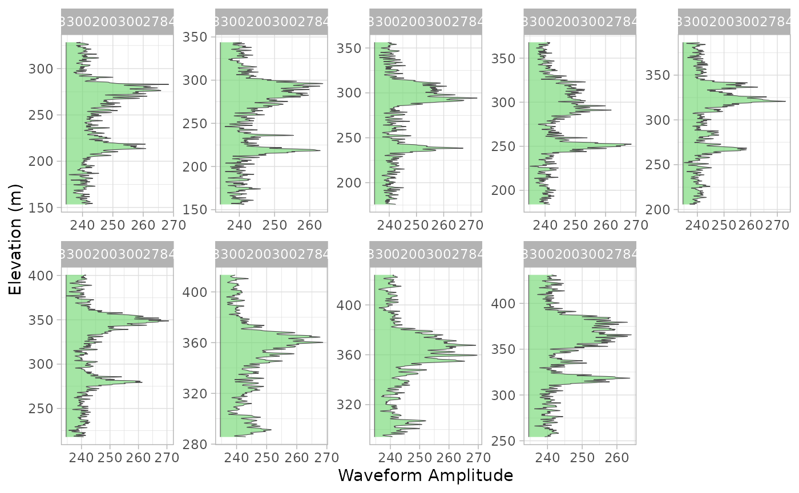
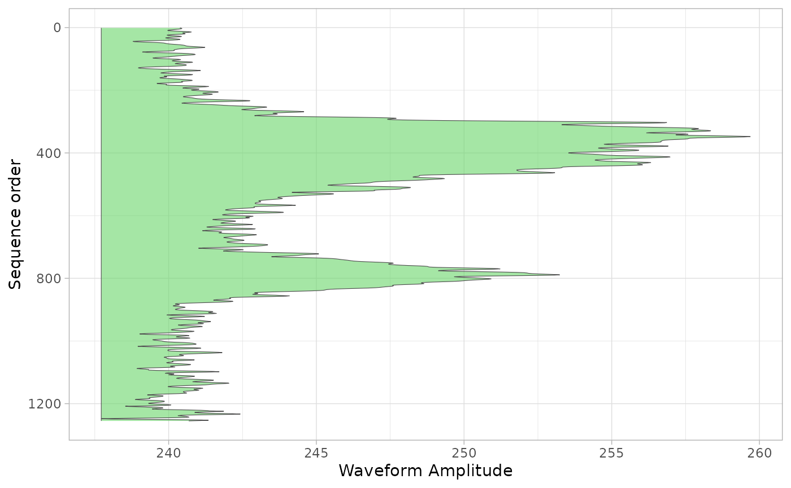

# GEDI Level 1B Waveforms

This vignette demonstrates how to use the `chewie` package to download
and extract GEDI Level 1B waveforms.

First let’s load the `chewie` package and the `ggplot2` package for
plotting.

``` r
library(chewie)
library(ggplot2)
library(sf)
library(dplyr)
```

First, we define an area of interest. In this case, we will use prairie
creek national park as our area of interest. The `chewie` package
provides a number of example spatial vector data sets that can be used
for this purpose. Here we use the `prairie-creek.geojson` data set,
which is a simple polygon defining the park boundary. You can
alternatively use the
[`st_read()`](https://r-spatial.github.io/sf/reference/st_read.html)
function to read in your own spatial vector data.

``` r
pcreek <- system.file(
  "geojson", "prairie-creek.geojson",
  package = "chewie"
) |>
  sf::read_sf()
```

Now we can search for GEDI Level 1B products that intersect with our
area of interest. We will search for products that were collected
between January 1st and January 31st, 2023.

``` r
g1b_search <- find_gedi(pcreek,
  gedi_product = "1B",
  date_start = "2023-01-01",
  date_end = "2023-01-31"
)
#> ✔ Using cached GEDI find result
print(g1b_search)
#> 
#> ── chewie.find ───────────────────────────────────────────────────────────────────────────────────────────────────────────────────
#> • GEDI-1B
#>                     id          time_start            time_end                                                   url cached
#>                 <char>              <POSc>              <POSc>                                                <char> <lgcl>
#> 1: G2755093540-LPCLOUD 2023-01-25 05:14:31 2023-01-25 06:47:21 https://data.lpdaac.earthdatacloud.nasa.gov/lp-pro...   TRUE
#> 1 variable not shown: [geometry <sfc_POLYGON>]
#> 
#> ──────────────────────────────────────────────────────────────────────────────────────────────────────────────────────────────────
```

You’ll see that only one granule was found. The returned `gedi.find`
object contains information about the search, including whether or not
the files are cached locally.

*Note: this vignette uses a cached granule which has been subset to
include only 3 beams to minimise the size of the package. The full
granule contains 8 beams.*

Now we can download the GEDI Level 1B products. However, note that the
[`grab_gedi()`](https://permian-global-research.github.io/chewie/reference/grab_gedi.md)
function will not download the products if they are already cached
locally. It first checks the cache and grabs the relevant files if they
exist. If they do not exist, they’ll be downloaded from the LPCLOUD
bucket. {chewie} will, by default only download specific data columns.
There are many variables contained in the raw hdf5 files.

``` r
gedi_1b_arrow <- grab_gedi(g1b_search)
#> ✔ All data found in cache
```

The
[`grab_gedi()`](https://permian-global-research.github.io/chewie/reference/grab_gedi.md)
function returns a *arrow_dplyr_query* object. If the user wishes to
carry out further filtering (for example using quality flags), this
should be done at this stage to avoid loading unnecessary data into
memory.

In order to access the data we must first collect the data into a data
frame. This could be done using
[`dplyr::collect`](https://dplyr.tidyverse.org/reference/compute.html).
However, the
[`collect_gedi()`](https://permian-global-research.github.io/chewie/reference/collect_gedi.md)
function is a wrapper around
[`dplyr::collect`](https://dplyr.tidyverse.org/reference/compute.html)
that also converts the data to an `sf` object, immediately providing a
spatial context for the data.

``` r
g1b_sf <- collect_gedi(gedi_1b_arrow, g1b_search)

print(g1b_sf)
#> Simple feature collection with 349 features and 82 fields
#> Geometry type: POINT
#> Dimension:     XY
#> Bounding box:  xmin: -124.0638 ymin: 41.39252 xmax: -123.9959 ymax: 41.43934
#> Geodetic CRS:  WGS 84
#> # A tibble: 349 × 83
#>    all_samples_sum  beam channel delta_time date_time           master_frac
#>  *           <int> <int>   <int>      <dbl> <dttm>                    <dbl>
#>  1        15740038     2       1 159862145. 2023-01-25 06:09:04       0.844
#>  2        15757882     2       1 159862145. 2023-01-25 06:09:04       0.852
#>  3        15758137     2       1 159862145. 2023-01-25 06:09:04       0.860
#>  4        15771162     2       1 159862145. 2023-01-25 06:09:04       0.868
#>  5        15761837     2       1 159862145. 2023-01-25 06:09:04       0.877
#>  6        15744387     2       1 159862145. 2023-01-25 06:09:04       0.885
#>  7        15746553     2       1 159862145. 2023-01-25 06:09:04       0.893
#>  8        15766075     2       1 159862145. 2023-01-25 06:09:04       0.901
#>  9        15750489     2       1 159862145. 2023-01-25 06:09:04       0.910
#> 10        15737307     2       1 159862145. 2023-01-25 06:09:04       0.918
#> # ℹ 339 more rows
#> # ℹ 77 more variables: master_int <int>, noise_mean_corrected <dbl>,
#> #   noise_stddev_corrected <dbl>, nsemean_even <dbl>, nsemean_odd <dbl>,
#> #   rx_energy <dbl>, rx_offset <int>, rx_open <int>, rx_sample_count <int>,
#> #   rx_sample_start_index <int>, selection_stretchers_x <int>,
#> #   selection_stretchers_y <int>, shot_number <chr>, stale_return_flag <int>,
#> #   th_left_used <int>, tx_egamplitude <dbl>, tx_egamplitude_error <dbl>, …

ggplot() +
  geom_sf(data = attributes(g1b_search)$aoi, fill = "#1bbe8086") +
  geom_sf(data = g1b_sf, aes(colour = elevation_lastbin)) +
  guides(colour = "none") +
  scale_color_viridis_c(option = "A") +
  theme_light()
```


So, here’s the cool bit about the way the Level-1B data are extracted.
We can access the full waveform for every shot in the data set by using
the
[`extract_waveforms()`](https://permian-global-research.github.io/chewie/reference/extract_waveforms.md)
function. This generates a long-form data frame with waveform amplitude,
relative elevation, and shot number for each shot. This enables the
combined analysis and comparison of many waveforms across space (and
time when we have multiple granules).

For example, here we take 8 of the waveforms…

``` r
g1b_wvf <- extract_waveforms(g1b_sf[100:108, ])

print(g1b_wvf)
#> # A tibble: 10,204 × 4
#>    shot_number        date_time           rxelevation rxwaveform
#>    <chr>              <dttm>                    <dbl>      <dbl>
#>  1 233300200300278449 2023-01-25 06:09:05        328.       239.
#>  2 233300200300278449 2023-01-25 06:09:05        328.       239.
#>  3 233300200300278449 2023-01-25 06:09:05        328.       238.
#>  4 233300200300278449 2023-01-25 06:09:05        328.       238.
#>  5 233300200300278449 2023-01-25 06:09:05        328.       239.
#>  6 233300200300278449 2023-01-25 06:09:05        328.       239.
#>  7 233300200300278449 2023-01-25 06:09:05        328.       240.
#>  8 233300200300278449 2023-01-25 06:09:05        327.       241.
#>  9 233300200300278449 2023-01-25 06:09:05        327.       241.
#> 10 233300200300278449 2023-01-25 06:09:05        327.       241.
#> # ℹ 10,194 more rows
```

And plot them using `ggplot2`…

``` r
wvf_ggplot <- function(x, wf, z, .ylab = "Elevation (m)") {
  wf <- sym(wf)
  z <- sym(z)
  ggplot(x, aes(x = !!z, y = !!wf)) +
    geom_ribbon(aes(ymin = min(!!wf), ymax = !!wf),
      alpha = 0.6, fill = "#69d66975", colour = "grey30", lwd = 0.2
    ) +
    theme_light() +
    coord_flip() +
    labs(x = .ylab, y = "Waveform Amplitude")
}

wvf_ggplot(g1b_wvf, "rxwaveform", "rxelevation") +
  facet_wrap(~shot_number, ncol = 5, scales = "free")
```



We can also calculate the mean waveform for these shots and plot it.
*Note that this may not be particualtly helpful for all contexts, but it
provides an indication of the power of having access to all waveforms in
a single dataset.*

``` r
g1b_wvf |>
  group_by(shot_number) |>
  arrange(rxelevation) |>
  mutate(id = dplyr::n():1) |>
  ungroup() |>
  group_by(id) |>
  summarise(
    mean_wvf = mean(rxwaveform),
    mean_elev = mean(rxelevation)
  ) |>
  wvf_ggplot("mean_wvf", "id", .ylab = "Sequence order") +
  scale_x_reverse()
```


